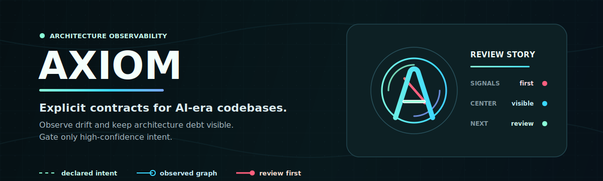

# Axiom



Axiom is an architecture compiler for AI-era codebases.

It reads `.axi` architecture contracts, scans real TypeScript/JavaScript source imports, builds declared and observed dependency graphs, and fails when the code breaks the declared architecture.

The core idea:

```text
.axi spec -> declared graph
source code -> observed graph
declared graph vs observed graph -> architecture breach report
```

Axiom is not an AI prompt wrapper. The first product is a real validator that can fail CI.

## Status

`v0.3.0` is an architecture firewall MVP with onboarding and adoption controls.

It currently supports:

- `.axi` parser.
- TypeScript/JavaScript import scanning through the TypeScript parser.
- Module path ownership.
- Multiple source paths per module.
- Declared vs observed dependency checks.
- Module visibility checks with `exposes` and `hides`.
- Layer direction checks.
- Starter contract inference with `axi infer`.
- Project config with source `include`/`exclude` and spec discovery patterns.
- TypeScript `paths` alias resolution from `tsconfig.json`, honoring `baseUrl`.
- Gradual adoption modes for unowned source files.
- Human-readable diagnostics.
- JSON output for CI and agents.
- Non-zero exit code on violations.

## Install

```bash
npm install
npm run build
```

Requirements:

- Node.js 20+
- npm

For local CLI use from a checkout:

```bash
npm install -g .
axi check --root fixtures/basic-ts-valid
```

When published as an npm package, the intended usage is:

```bash
npx <package-name> check --root .
axi check --root .
```

## Quickstart

Create an architecture contract:

```axi
layers Core -> UI

module Physics
path "src/physics/**"
layer Core

module Rendering
path "src/rendering/**"
layer UI

module Simulation
path "src/simulation/**"
path "packages/simulation/src/**"
layer Core
depends on Physics
forbids module Rendering
exposes "src/simulation/index.ts"
hides "src/simulation/internal/**"
purpose "deterministic physics simulation"
```

Run the validator:

```bash
node dist/cli.js check --root fixtures/basic-ts-valid
```

Expected output:

```text
Axiom check passed.
modules: 3
source files: 3
imports scanned: 1
observed dependencies: 1
```

Try a failing example:

```bash
node dist/cli.js check --root fixtures/layer-breach
```

Expected output:

```text
Axiom check failed.
violations: 1

error layer_breach src/simulation/step.ts:1
  Simulation in layer Core imports Rendering in outer layer UI.
  observed: Simulation -> Rendering via "../rendering/draw"
  rule: layers Core -> UI (axiom/main.axi:1)
  fix: Move the dependency inward, invert the dependency, or change the layer declarations.
```

## CLI

```bash
node dist/cli.js check --root <project>
node dist/cli.js check --root <project> --config axiom.config.json --json
node dist/cli.js check --root <project> --warn-unowned
node dist/cli.js check --root <project> --strict
node dist/cli.js graph --root <project>
node dist/cli.js graph --root <project> --json
node dist/cli.js infer --root <project>
node dist/cli.js infer --root <project> --json
```

Default discovery skips common dependency, build, cache, generated, and local runtime folders:

```text
.benchmark_tmp
.cache
.git
.next
.nuxt
.svelte-kit
.turbo
.vite
build
coverage
dist
generated-projects
node_modules
out
src-tauri
target
temp
tmp
```

Exit codes:

- `0`: no violations
- `1`: one or more violations

`axi graph` is for inspection and exits `0` even when the graph contains violations. Use `axi check` as the CI gate.

`axi infer` is for onboarding. It scans the current relative import graph and prints a starter `.axi` contract to stdout without writing files:

```bash
node dist/cli.js infer --root .
```

The inferred contract groups source files by source folders, declares the dependencies that already exist, and collapses cyclic candidate groups into one module so the starter spec mirrors today's code. Treat the output as a draft: rename modules, split broad groups, and add `forbids module`, `exposes`, `hides`, and `layers` rules as the architecture settles.

## Project Config

Axiom reads `axiom.config.json` from the project root when it exists. You can also pass a root-relative config path:

```bash
axi check --root . --config axiom.config.json
axi infer --root . --config axiom.config.json
```

Minimal config:

```json
{
  "include": ["src/**"],
  "exclude": ["src/**/*.test.ts", "src/generated/**"],
  "specs": ["architecture/**/*.axi", "*.axi"],
  "tsconfig": "tsconfig.app.json"
}
```

Fields:

- `include`: source files to scan. If omitted, Axiom scans all supported source files outside default ignored directories.
- `exclude`: source files or directories to skip, in addition to default ignored directories.
- `specs`: `.axi` spec files to read. Defaults to `axiom/**/*.axi` and `*.axi`.
- `tsconfig`: TypeScript config path used for `paths` import alias resolution, honoring `baseUrl`. Defaults to `tsconfig.json` when present.

Config paths and patterns are relative to `--root`. Default ignored directories such as `node_modules`, `dist`, `.git`, and `src-tauri` are still skipped.

## JSON Output

`axi check --json` emits a stable v2 payload for CI and agent feedback loops:

```json
{
  "schemaVersion": "axiom.check.v2",
  "ok": false,
  "root": "/absolute/project/root",
  "summary": {
    "modules": 2,
    "specFiles": 1,
    "sourceFiles": 2,
    "importsScanned": 1,
    "observedDependencies": 1,
    "violations": 1,
    "warnings": 0
  },
  "specFiles": ["axiom/main.axi"],
  "sourceFiles": ["src/rendering/draw.ts", "src/simulation/step.ts"],
  "modules": [
    {
      "name": "Rendering",
      "paths": ["src/rendering/**"],
      "layer": "UI",
      "depends": [],
      "exposes": [],
      "hides": [],
      "forbidsModules": [],
      "location": {
        "filePath": "axiom/main.axi",
        "line": 3
      }
    },
    {
      "name": "Simulation",
      "paths": ["src/simulation/**"],
      "layer": "Core",
      "depends": ["Rendering"],
      "exposes": [],
      "hides": [],
      "forbidsModules": [],
      "location": {
        "filePath": "axiom/main.axi",
        "line": 7
      }
    }
  ],
  "observedDependencies": [
    {
      "fromModule": "Simulation",
      "toModule": "Rendering",
      "import": {
        "filePath": "src/simulation/step.ts",
        "line": 1,
        "specifier": "../rendering/draw",
        "resolvedPath": "src/rendering/draw.ts"
      }
    }
  ],
  "violations": [
    {
      "code": "layer_breach",
      "message": "Simulation in layer Core imports Rendering in outer layer UI.",
      "location": {
        "filePath": "src/simulation/step.ts",
        "line": 1
      },
      "details": {
        "fromModule": "Simulation",
        "toModule": "Rendering",
        "observed": "Simulation -> Rendering",
        "rule": "layers Core -> UI",
        "ruleLocation": {
          "filePath": "axiom/main.axi",
          "line": 1
        },
        "suggestion": "Move the dependency inward, invert the dependency, or change the layer declarations."
      }
    }
  ],
  "warnings": []
}
```

## Adoption Modes

By default, Axiom ignores source files that are not owned by any module `path`. This keeps partial adoption cheap.

Use `--warn-unowned` to report unowned source files without failing the check:

```bash
axi check --root . --warn-unowned
```

Use `--strict` when the contract is mature enough that every discovered source file should be owned:

```bash
axi check --root . --strict
```

Paths inside `specFiles`, `sourceFiles`, `modules`, `observedDependencies`, `violations`, and `warnings` are relative to `root`. Code-specific data lives under `violations[].details` and `warnings[].details`; consumers should key primarily on `schemaVersion`, `ok`, `summary`, and diagnostic `code`.

## Graph Output

`axi graph` prints the declared graph, forbidden edges, visibility rules, and observed graph:

```text
Axiom graph.
modules: 2
declared dependencies: 1
forbidden dependencies: 0
observed dependencies: 3
violations: 2
warnings: 0

declared dependencies:
  UI -> Services (axiom/main.axi:3)

forbidden dependencies:
  none

visibility:
  Services exposes src/services/index.ts (axiom/main.axi:7)
  Services hides src/services/internal/** (axiom/main.axi:8)

observed dependencies:
  UI -> Services via src/ui/view.ts:1 "../services"
  UI -> Services via src/ui/view.ts:2 "../services/feature"
  UI -> Services via src/ui/view.ts:3 "../services/internal/secret"
```

`axi graph --json` emits a stable `axiom.graph.v2` payload with `modules`, `declaredDependencies`, `forbiddenDependencies`, `exposedPaths`, `hiddenPaths`, `observedDependencies`, and compact `violations` and `warnings` lists.

## Infer Output

`axi infer --json` emits a draft-oriented `axiom.infer.v1` payload:

```json
{
  "schemaVersion": "axiom.infer.v1",
  "root": "/absolute/project/root",
  "summary": {
    "sourceFiles": 3,
    "importsScanned": 1,
    "candidateModules": 3,
    "modules": 3,
    "observedDependencies": 1,
    "collapsedCycles": 0
  },
  "modules": [
    {
      "name": "Simulation",
      "paths": ["src/simulation/**"],
      "depends": ["Physics"],
      "sourceGroups": ["Simulation"]
    }
  ],
  "observedDependencies": [],
  "collapsedCycles": [],
  "axi": "# Generated by axi infer.\\n..."
}
```

The text mode is intentionally valid `.axi` with comments, so it can be redirected into a file when the draft looks right.

## Violation Types

Axiom v0.3 can report:

- `forbidden_dependency`
- `undeclared_dependency`
- `hidden_import`
- `unexposed_import`
- `unowned_source_file`
- `layer_breach`
- `ambiguous_module_owner`
- `cycle_dependency`
- `unknown_module`
- `unknown_layer`
- `duplicate_module`
- `duplicate_layer_order`
- `missing_module_path`
- `parse_error`
- `no_spec_files`

## Import Resolution

The current scanner resolves TypeScript/JavaScript relative imports, including:

- `import ... from "../module"`
- `export ... from "../module"`
- side-effect imports such as `import "../setup"`
- multiline import/export declarations
- `import("../module")`
- `require("../module")`
- TypeScript `import type` and `import foo = require("../module")`
- directory barrel imports that resolve to `index.ts`, `index.tsx`, `index.js`, and related JS/TS extensions
- TypeScript `paths` aliases from `tsconfig.json` or a configured `tsconfig` path, honoring `baseUrl`

The scanner uses the TypeScript parser for syntax discovery, then Axiom's resolver maps internal imports to source files. Full TypeScript package-style `extends` resolution from `node_modules` and full TypeScript module resolution remain planned hardening work.

## Test Fixtures

Useful fixtures:

- `fixtures/basic-ts-valid`
- `fixtures/basic-ts-invalid`
- `fixtures/basic-ts-undeclared`
- `fixtures/layer-valid`
- `fixtures/layer-breach`
- `fixtures/visibility-rules`
- `fixtures/ambiguous-owner`
- `fixtures/cycle`

## Development

```bash
npm test
npm run check:fixture
node dist/cli.js check --root fixtures/layer-breach --json
```

## License

Apache-2.0. See [LICENSE](LICENSE).

## Roadmap

Near-term:

- Better `axi infer` grouping and visibility-rule suggestions.
- GitHub Actions example.
- External package dependency modelling.

Later:

- Capability rules such as wall clock, network, filesystem, and random.
- AI context compiler as a derived output.
- Agent repair loop.
