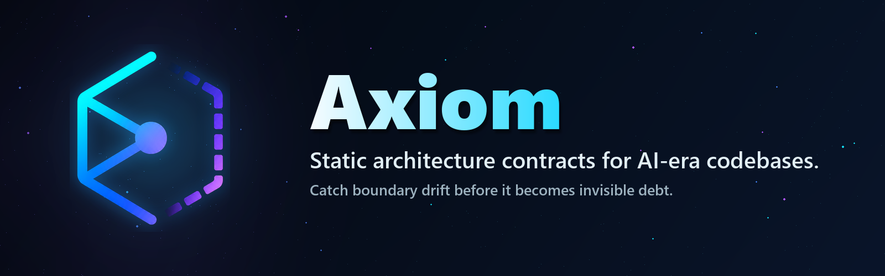

# Axiom

[](https://github.com/fatelvx/axiom/actions/workflows/ci.yml)



**Static architecture contracts for AI-era TypeScript and JavaScript codebases.**

Axiom compares the architecture you declared in `.axi` with the imports that actually exist in source code.

Use it to:

- fail CI on explicit boundary drift,
- review advisory architecture pressure before it becomes a rule,
- keep intentional debt visible,
- give agents the same evidence humans and CI see.

`Static Contract Loop` milestone: usable today for static TS/JS import graphs. Dynamic evidence, Python, VS Code, and contract sharing are post-static work.

[Quick Start](#quick-start) | [Example Contract](#example-contract) | [Commands](#commands) | [Integrations](#integrations) | [Limits](#limits) | [Guides](#guides)

## The Loop

| Input | Axiom Builds | Output |
| --- | --- | --- |
| `.axi` contract | Declared graph | What the architecture says should be allowed |
| TS/JS imports | Observed graph | What the code actually imports |
| Baseline + debt | Review context | Drift, advisory pressure, and accepted violations |

A hard gate is only one part of the loop:

```text
axi check   = CI gate for reviewed contracts
axi observe = review story, warnings, debt, drift
axi infer   = starter contract evidence, not architecture intent
axi diff    = advisory observed-edge drift against a graph baseline
```

## Why It Exists

AI agents and humans both guess architecture from nearby files. That works until a codebase changes faster than reviewers can keep the global shape in their heads.

Axiom turns rules like this:

```text
UI may depend on Services, but only through the public Services entry point.
Services internals must stay private.
Domain must not import UI.
```

into a machine-checkable contract with file, line, rule, and fix guidance.

It is not a prompt wrapper and not a style linter. It is an architecture observability layer with enforceable contracts where the intent is clear enough.

## Quick Start

Install the public alpha:

```bash
npm install --ignore-scripts -D @fatelvx/axiom@0.6.0-alpha.4 --save-exact
npx --no-install axi infer --root . --include "src/**"
```

`--no-install` makes npm use the exact local package you just installed instead of fetching a different command from the registry.

`axi infer` is read-only starter evidence. It mirrors the graph Axiom can currently see; review it before turning it into a contract.

To try the hard gate, add a small `axiom/main.axi` contract like the one below, then run:

```bash
npx --no-install axi check --root . --include "src/**"
```

When the code violates the reviewed contract, `axi check` exits `1` and reports file-level errors such as:

```text
error unexposed_import src/ui/view.ts:2
  UI imports a non-exposed path from Services.

error hidden_import src/ui/view.ts:3
  UI imports hidden path from Services.
```

Try the review surface:

```bash
npx --no-install axi observe --root . --include "src/**" --warn-large-files
npx --no-install axi graph --root . --include "src/**" --attention
```

Want a controlled example first?

```bash
git clone https://github.com/fatelvx/axiom.git
cd axiom
npm install --ignore-scripts
npm run build
node dist/cli.js check --root examples/spec-first-pilot
node dist/cli.js check --root examples/spec-first-services-pilot
```

## Example Contract

Write `axiom/main.axi`:

```axi
module Services
path "src/services/**"
exposes "src/services/index.ts"
hides "src/services/internal/**"

module UI
path "src/ui/**"
depends on Services
```

Then this is allowed:

```ts
import { getDashboardTitle } from "../services";
```

And this is reported:

```ts
import { issueServiceToken } from "../services/internal/token";
```

That hard error is different from an advisory public-entry bypass. In a looser early contract that has module paths but not strict `hides` / `exposes` rules yet, `--warn-deep-internal-imports` can still point at imports that bypass a likely `index.*` entry point:

```ts
import { parseToken } from "../services"; // likely public entry point
import { parseToken } from "../services/internal/token"; // advisory deep_internal_import
```

The hidden internal import becomes an explicit contract violation when `hides` says `internal/**` is private. Without that strict contract, the same shape can still be a review signal: Axiom can see code reaching around a likely entry point, but it does not fail CI unless the team turns that intent into a clear contract.

## Static v0 Coverage

Axiom v0.6.0-alpha.4 is focused on static TypeScript and JavaScript architecture evidence, including Vue single-file component script imports. Current `main` also includes unreleased static Python import scanning.

| Area | Supported |
| --- | --- |
| Contract model | `module`, `path`, `depends on`, `forbids module`, `layers`, `exposes`, `hides`, `purpose` |
| Hard violations | dependency drift, layer breaches, hidden imports, hidden re-exports, ambiguous owners, broken specs |
| Advisory review | deep internal imports, public API surface pressure, coupling concentration, unresolved imports, dynamic dependency expressions, large files |
| Scanner | TS/JS parser imports, Vue SFC `<script>` imports, `require`, literal dynamic imports, multiline imports, barrel `index.*` files |
| Resolver | relative paths, `.vue` components, tsconfig `paths`, package `imports`, workspace `exports` / `main`, pnpm workspaces |
| Adoption | loose mode, `--warn-unowned`, `--strict`, time-bounded intentional violations |
| Outputs | human, JSON, Markdown, Mermaid, review stories, `topSignals`, baseline drift |
| Agent surfaces | GitHub Actions examples, JSON consumer guide, read-only MCP server |

Unreleased on `main`: conservative Python `.py` import scanning for repo-local static imports, plus ordered `pythonImportRoots` config for projects whose Python source roots are not obvious from folder shape alone.

## How To Read A Graph

Start with three questions:

1. Are there hard violations, visible accepted debt, or advisory signals?
2. Which module is the graph center by observed import pressure?
3. Does that shape match the architecture you expected?

`axi graph`, `axi observe`, and JSON summaries now include an interpretation layer for this first read. It can say, for example, that the scoped graph is quiet, that a module is becoming a fan-in hub, or that a contract is failing before the diagram should be treated as stable. The interpretation is intentionally conservative: it helps you navigate the graph, but the evidence still lives in the exact violation, warning, drift, and import-site lists.

When a scan is quiet, the next step is not "declare victory". Compare the graph center with the shape you expected, check whether huge files are hiding responsibilities inside one module, then save an unfiltered portable `axi graph --json --portable` baseline if that shape is intentional.

For concrete examples of failing contracts, quiet graphs, advisory pressure, and React plus Pixi game clients, read [Read The Graph](guides/read-the-graph.md).

## Limits

Axiom v0 is intentionally honest about its blind spots:

- It does not fully observe runtime-only dependency paths such as string-based dependency injection, plugin registries, generated imports, or `eval`.
- It can optionally warn about static relative or package `#imports` that the scanner sees but cannot resolve with `--warn-unresolved-imports`.
- It can optionally warn about non-literal `import()` / `require()` expressions with `--warn-dynamic-imports`, but those remain graph-completeness evidence, not observed dependency edges.
- It does not prove that a module is semantically well-designed. Axiom can catch direct hidden-path re-exports and local import-then-export leaks from hidden internals, `--warn-public-api-surface` can flag broad `export *` barrels and exposed entry points that reach many internal files, and `--warn-deep-internal-imports` can flag relative imports that bypass likely entry points, but code can still become too coupled through wrappers, facades, or overly large public entry points. This is the `symbol-level API health` gap.
- It does not prove that concentrated fan-in or fan-out is wrong. `--warn-coupling-concentration` surfaces modules that may be turning into coordination hubs so humans and agents can review the pressure before it becomes hidden debt.
- It does not prove that a quiet import graph means the code is internally well-factored. `--warn-large-files` only surfaces large-file pressure as an advisory review prompt; it is not a general complexity metric or a refactor mandate.
- It does not replace ESLint, TypeScript, tests, or review. Axiom focuses on architecture intent: declared graph, observed graph, drift, warnings, intentional violations, and CI gates for clear contracts.
- It does not replace Dependency Cruiser, Nx boundaries, CodeQL, or custom repository scripts. See [Comparison And Boundaries](guides/comparison.md) for where Axiom is useful and where other tools are stronger.
- It does not make `.axi` maintenance free. Use `axi infer` to start from the current graph, then tighten only the boundaries that matter.
- It does not promise whole-monorepo speed without scope control. Use `include`, `exclude`, and focused contract locations to keep large repositories comfortable in CI.

The product goal is not perfect automatic architecture governance. The goal is a shared, machine-checkable observability layer where humans and agents can see drift early, accept temporary debt visibly, and enforce high-confidence boundaries.

## Install

Requirements:

- Node.js 20+
- npm

Axiom's npm package target is `@fatelvx/axiom`. The unscoped `axiom` package name is already used by another package, so the public alpha uses a scoped package.

Project install:

```bash
npm install --ignore-scripts -D @fatelvx/axiom@0.6.0-alpha.4 --save-exact
npx --no-install axi check --root .
npx --no-install axiom check --root .
```

Pin the alpha version your repository has reviewed, then upgrade intentionally when you are ready to test a newer alpha.

Local checkout for contributors:

```bash
npm install --ignore-scripts
npm run build
```

Optional global install from this checkout:

```bash
npm install --ignore-scripts -g .
axi check --root examples/basic-app
```

## Commands

| Command | Role |
| --- | --- |
| `axi check --root <project>` | Hard gate for reviewed `.axi` contracts. Exits `1` on hard violations. |
| `axi observe --root <project>` | Advisory review story: violations, debt, warnings, drift context. |
| `axi graph --root <project>` | Full declared and observed graph inspection. |
| `axi diff <baseline-json> --root <project>` | Advisory observed-edge drift against a saved graph baseline. |
| `axi infer --root <project>` | Starter contract evidence from the current graph; not declared intent. |

Common output flags: `--json`, `--markdown`, `--mermaid`, `--attention`.

Common adoption flags: `--include`, `--exclude`, `--spec`, `--baseline`, `--strict`, `--warn-unowned`, `--warn-public-api-surface`, `--warn-unresolved-imports`, `--warn-dynamic-imports`, `--warn-coupling-concentration`, `--warn-deep-internal-imports`, `--warn-large-files`.

## Integrations

| Surface | Status | Use it for |
| --- | --- | --- |
| GitHub Actions | Example workflow included | Keep `axi check` as the PR gate and attach `axi observe` as review context |
| JSON / Markdown | Stable v0 schemas | Feed CI annotations, PR summaries, dashboards, and agents |
| MCP | Read-only stdio preview | Let agents query roots, checks, graphs, diffs, inference, and temporary inferred review evidence |

Start with [GitHub Actions And PR Summaries](guides/github-actions.md), [JSON Consumers](guides/json-consumers.md), or [MCP Client Setup](guides/mcp-client-setup.md).

## Adoption Paths

| Starting point | Use |
| --- | --- |
| New contract | [Getting Started](guides/getting-started.md), then [Contract Recipes](guides/contract-recipes.md) |
| Existing repo | `axi infer --root .`, then [Adopting Axiom In A Real Project](guides/adoption.md) |
| External pilot | [Pilot Workflow](guides/pilot-workflow.md) keeps `.axi` outside the target repo |
| PR workflow | [GitHub Actions And PR Summaries](guides/github-actions.md) |
| Agent workflow | [Agent And MCP Integration](guides/agent-loop.md) and [MCP Preview](guides/mcp-preview.md) |
| Alpha evaluation | [Alpha Notes](guides/alpha-notes.md) |

## Monorepos And Config

Axiom understands common npm, pnpm, and Turborepo-style workspace layouts. By default it discovers `.axi` specs from:

```text
axiom/**/*.axi
*.axi
apps/*/axiom/**/*.axi
apps/*/*.axi
packages/*/axiom/**/*.axi
packages/*/*.axi
```

Try the monorepo example:

```bash
node dist/cli.js check --root examples/monorepo-workspace
node dist/cli.js graph --root examples/monorepo-workspace --violations-only
```

Axiom reads `axiom.config.json` from the project root when present. Use it to scope source files, point at external spec locations, select a TypeScript config, and opt into advisory signal families:

```json
{
  "include": ["src/**"],
  "exclude": ["src/**/*.test.ts", "src/generated/**"],
  "specs": ["axiom/**/*.axi"],
  "tsconfig": "tsconfig.json",
  "intentionalViolationExpiryWarningDays": 30,
  "warnUnresolvedImports": false,
  "warnDynamicImports": false,
  "warnPublicApiSurface": false,
  "warnCouplingConcentration": false,
  "warnDeepInternalImports": false,
  "warnLargeFiles": false
}
```

For detailed config fields and discovery rules, read [Getting Started](guides/getting-started.md) or [SPEC_V0](docs/SPEC_V0.md).

## Intentional Debt

When a real project needs a temporary intentional violation, keep it visible in `.axi`:

```axi
module UI
path "src/ui/**"
forbids module ServicesInternal
accepts forbidden_dependency to ServicesInternal until 2027-06-30 because "legacy import while the public service API is split out"
```

Expired debt fails the check, invalid debt cannot hide violations, entries expiring within 30 days become warnings, and unused entries are warnings so old architecture debt stays visible after cleanup. `axi observe --markdown` shows the debt ledger for review.

## Advisory Signals

Warnings are opt-in review signals, not default CI gates:

| Flag | Review signal |
| --- | --- |
| `--warn-public-api-surface` | Broad exposed barrels and exposed entry points reaching many internal files |
| `--warn-unresolved-imports` | Static imports Axiom can see but cannot resolve into the source graph |
| `--warn-dynamic-imports` | Non-literal `import()` / `require()` expressions that static graphing cannot resolve |
| `--warn-coupling-concentration` | High module fan-in or fan-out pressure |
| `--warn-deep-internal-imports` | Relative imports bypassing likely `index.*` entry points |
| `--warn-large-files` | Large files that may hide intra-file responsibility pressure |

Use these in `observe` first. When an enabled family reports no findings, graph / observe output can say it was checked with no findings; that is static evidence scope, not proof that the architecture is healthy. Promote only high-confidence intent into `.axi` hard rules.

## JSON And Markdown Output

`axi check --json` emits `axiom.check.v4`; `axi graph --json` and `axi observe --json` emit `axiom.graph.v12`.

Use an unfiltered portable graph JSON file as a baseline when you want to inspect architecture drift:

```bash
axi graph --root . --json --portable > axiom-baseline.json
axi observe --root . --baseline axiom-baseline.json
```

Markdown output is useful for PR comments and agent repair loops:

For schemas and consumer rules, read [JSON Consumers](guides/json-consumers.md). For the portable `.axi + baseline + reviewStory + intentionalDebt` convention, read [Evidence Artifact Loop](guides/evidence-artifact.md).

## CI

This repository dogfoods Axiom in GitHub Actions:

```bash
npm ci
npm run ci
```

It also tracks a portable self graph baseline at `.axi/baselines/current.graph.json`. That file is Axiom's own dogfood policy, not a product default: `npm run axiom:self:artifact` verifies the baseline is portable, advisory review commands do not rewrite it, and current self-contract drift is zero.

For your own project, add a script:

```json
{
  "scripts": {
    "axiom": "axi check --root ."
  }
}
```

Then run that script in CI after installing dependencies.

For a fuller PR workflow, use [GitHub Actions And PR Summaries](guides/github-actions.md). It shows how to keep `axi check --json` as the hard gate, convert hard violations into GitHub annotations, and append `axi observe --json` `architectureSummary` as review context without making advisory signals or drift accidental blockers.

## Guides

- [Getting Started](guides/getting-started.md)
- [Alpha Notes](guides/alpha-notes.md)
- [Adopting Axiom In A Real Project](guides/adoption.md)
- [Contract Recipes](guides/contract-recipes.md)
- [Pilot Workflow](guides/pilot-workflow.md)
- [Evidence Artifact Loop](guides/evidence-artifact.md)
- [Read The Graph](guides/read-the-graph.md)
- [10-Minute Pilot Card](guides/pilot-card.md)
- [Comparison And Boundaries](guides/comparison.md)
- [GitHub Actions And PR Summaries](guides/github-actions.md)
- [JSON Consumers](guides/json-consumers.md)
- [Agent And MCP Integration](guides/agent-loop.md)
- [MCP Client Setup](guides/mcp-client-setup.md)
- [MCP Conformance](guides/mcp-conformance.md)
- [MCP Preview](guides/mcp-preview.md)
- [Publishing The Public Alpha](guides/publishing-alpha.md)
- [Contributing](CONTRIBUTING.md)
- [Basic App Example](examples/basic-app)
- [Monorepo Workspace Example](examples/monorepo-workspace)
- [GitHub Actions Example](examples/github-actions)

## Violation Types

Axiom can currently report:

- `forbidden_dependency`
- `undeclared_dependency`
- `hidden_import`
- `hidden_reexport`
- `broad_public_surface`
- `public_entrypoint_coupling`
- `coupling_concentration`
- `unresolved_import`
- `unexposed_import`
- `unowned_source_file`
- `invalid_suppression`
- `expired_suppression`
- `expiring_suppression`
- `unused_suppression`
- `layer_breach`
- `ambiguous_module_owner`
- `cycle_dependency`
- `unknown_module`
- `unknown_layer`
- `duplicate_module`
- `duplicate_layer_order`
- `missing_module_path`
- `parse_error`
- `no_spec_files`

## Development

```bash
npm run ci
npm test
npm run axiom:self
npm run mcp:smoke
npm run perf:smoke
npm run github-actions:smoke
npm run release:candidate:smoke
npm run alpha:check
npm run check:fixture
node dist/cli.js check --root examples/basic-app
```

## Community

Questions, contract-design discussions, and rough ideas are welcome. Use [GitHub Discussions](https://github.com/fatelvx/axiom/discussions) for open-ended design conversation when available, or [open an issue](https://github.com/fatelvx/axiom/issues) for bugs and concrete feature requests. See [CONTRIBUTING.md](CONTRIBUTING.md) before proposing `.axi` language changes.

## Roadmap

Current milestone:

- `v0.6.0-alpha.4`: Static Contract Loop. The static TS/JS validator, review surfaces, GitHub Actions examples, read-only MCP evidence loop, spec-first artifact smoke, and hardened safe-install docs are packaged as the current public alpha milestone.

Next:

- Python source-root calibration and spec-first pilots over the same static evidence loop.
- More release-candidate testing from packaged tarballs and clean temp projects.
- More spec-first pilots on real repositories before stronger CI claims.
- VS Code authoring and drift navigation over the same CLI/JSON evidence.
- Contract templates, inheritance, and sharing only after the single-repo validator loop is trusted.

Later:

- Capability rules such as wall clock, network, filesystem, and random.
- AI context compiler and repair loops as derived outputs, not replacements for validation.

## License

Apache-2.0. See [LICENSE](LICENSE).
